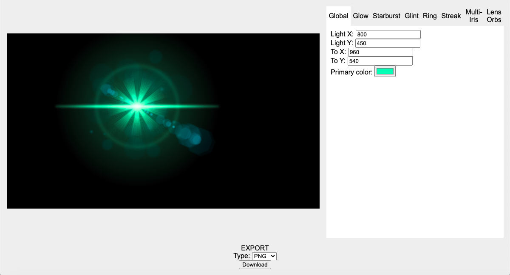

# Usage
Fill in document width and height and press "Start editing." In the right panel, use the tabbar to select a component and edit the input fields shown. A preview will appear to the left. To export, press the "download" button at the bottom of the screen. To save information about your flare, select "JSON" as the export type.